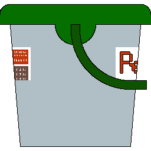

 
# Gerçek Kesit Çizim Programı

Bu proje, jeoloji mühendisleri ve yer bilimleri uzmanları için tasarlanmış, jeolojik kesitlerin hızlı ve doğru bir şekilde çizilmesini sağlayan bir programdır. Gerçek Kesit Programı, kullanıcı dostu arayüzü ve kapsamlı özellikleriyle jeolojik kesitlerin detaylı bir şekilde çizilmesine yardımcı olur.

  

## Özellikler

- **Kolay Çizim Arayüzü**: Basit ve kullanıcı dostu arayüz ile jeolojik kesitlerinizi oluşturabilirsiniz.
- **Otomatik Çizim**: Formasyonların bilgileri otomatik eklenir.
- **Özelleştime**: Yeni Desen, formaslar ve muhafaza boruları ekleyebilirsiniz.
- **Dışa Aktarma**: Çizimlerinizi PNG, JPEG veya BMP formatında dışa aktarın.

